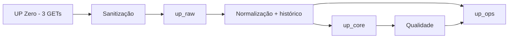

# UP Data Intelligence — Data Foundation / Fase 1

Implementação local para uma loja piloto: **UP Zero → ingestão → RAW sanitizado → CORE → qualidade/OPS → BigQuery**. Somente customers, orders e analytics/facts. Nenhum recurso GCP foi criado, nenhum secret real foi utilizado e nenhum endpoint de produção foi chamado durante o desenvolvimento.

## Componentes

- `src/connectors/upzero`: GET com X-API-Key, paginação específica por recurso, timeout, retries/backoff e Retry-After; transporte sintético offline.
- `src/security`: sanitização recursiva antes de RAW, Secret Manager por referência e exclusão mútua por loja.
- `src/ingestion`: RAW antes de CORE, checkpoints por plano/janela, retomada, replay e planejamento incremental.
- `src/normalization`: clientes, pedidos/itens, fatos, parser Meta de URL; sem chamadas à Meta.
- `src/bigquery`: schemas compartilhados, transações MERGE parametrizadas e adaptador SQLite para testes locais.
- `src/quality` e `sql/quality`: duplicatas, integridade, vigência de purchase/order_id, parser e freshness.
- `src/jobs`: CLI de sync, backfill, reconciliação, qualidade e replay.
- `infra/terraform`: datasets/tabelas, IAM, contas de serviço, jobs e schedules pausados; container de Secret Manager sem versão ou valor.



`up_analytics` é provisionável, mas não contém tabelas/produtos analíticos. Não há atribuição, CAC, LTV, Dashboard, MCP ou IA.

## Setup e dependências

Python 3.13, `uv` e Terraform 1.16.x para validação opcional da infraestrutura. Dependências diretas fixadas no `pyproject.toml`; resolução transitiva em `uv.lock`; `requirements.lock` fixa runtime com hashes. Provider Google 8.4.0 fixado e lockfile versionado. A imagem Docker base usa Python 3.13-slim-bookworm, usuário não-root e instalação de wheels com hashes; para release, fixar também o digest da base via PYTHON_BASE. Terraform exige digest da imagem final.

```bash
uv sync --frozen
uv run pytest --cov=src --cov-report=term-missing
uv run ruff check src tests
uv run ruff format --check src tests
uv run mypy src
```

A suíte bloqueia conexões de rede. Fixtures são sintéticas e utilizam example.invalid. Não adicionar auditorias reais ao repositório. Dependências podem ser auditadas com `uv run pip-audit -r requirements.lock --disable-pip --no-deps`.

## Execução local segura (padrão offline)

A partir da raiz do repositório:

```bash
uv run python -m src.jobs.backfill --config config.example.json \
  --resource all --from 2026-09-01 --to 2026-09-03
uv run python -m src.jobs.cli --mode quality
uv run python -m src.jobs.cli --mode sync --to 2026-09-04T00:00:00Z
```

Sem `--live`, todas as respostas vêm de `tests/fixtures/pilot.json` via MockTransport; SQLite em `.local/pilot.sqlite` é somente o adaptador local, não o banco cloud. O transporte de fixtures demonstra paginação, mas não simula todos os filtros temporais da API. A CLI não carrega `.env` automaticamente. `.env.example` contém apenas referências; `.env`, `.local`, estados e arquivos `.tfvars` privados ficam ignorados. Somente os `dev.tfvars` aprovados (Foundation, registry e bootstrap), sem credenciais e com placeholders, são versionados; nunca adicionar secrets a eles.

Datas sem horário na CLI significam meia-noite UTC. Facts usam `[from,to)`; clientes e pedidos convertem janelas para os filtros de data de suas APIs. Pedidos usam timezone da configuração: pode haver sobreposição de datas entre lotes, resolvida por idempotência. Para dias locais exatos, fornecer offsets explícitos.

## Modos e retomada

- **sync**: facts a partir do último checkpoint completo menos lookback; pedidos novos/recentes e faixas de criação dos pedidos abertos; clientes em ID DESC até cruzar o maior ID conhecido. Nunca usa updated_at como filtro inexistente.
- **backfill**: janelas diárias, paginadas, por recurso. Mesmo plano completo é no-op; `--refresh` cria nova observação da fonte. Reexecutar mesma chamada retoma uma execução interrompida.
- **reconcile**: clientes completos; pedidos/facts por intervalos históricos desde initial_from (ou `--from`). No cloud é job diário separado, inicialmente pausado. Para piloto grande, reduzir intervalo e distribuir manualmente; não há garantia de conclusão em uma hora para qualquer volume.
- **quality**: reavalia relações e cobertura atuais; não faz chamadas à UP Zero.
- **replay**: reprocessa RAW sanitizado de um run sem chamar a fonte:

```bash
uv run python -m src.jobs.cli --mode replay --resource analytics_facts --replay-run RUN_ID
```

RAW e checkpoint pending são gravados atomicamente antes de transformar. Promoção CORE/histórico/OPS é outra transação. Corrupção de paginação mantém RAW e exige corrigir/reiniciar o plano com `--refresh`. Uma transformação inválida mantém RAW e marca `needs_review`; não avança o checkpoint completo. Replay produz relatório próprio; o checkpoint original em needs_review requer revisão e uma nova coleta validada (`--refresh`) antes de ser considerado completo.

Replay antigo não substitui estado observado mais recente. Transformação versionada preserva histórico; itens removed são mantidos e itens ausentes de snapshot completo ficam com `present_in_latest_snapshot=false`, sem inventar exclusão de negócio. Arrays omitidos não removem itens conhecidos.

## Configuração e primeiro teste real (não executado)

Copiar config.example.json para arquivo ignorado em `.local/` e preencher:

1. project_id exclusivo do ambiente, location do BigQuery, região Cloud Run, bucket técnico de locks e imagem já construída por digest.
2. store_id/name/slug, timezone efetiva UP Zero, identificador UP Zero se conhecido e connection_id.
3. secret_resource_name completo (`projects/.../secrets/.../versions/...`) de um secret que já exista. Somente referência; não colar API Key em config, CLI ou chat.
4. initial_from, intervalo pequeno do piloto, lookbacks, stale_after_minutes, opcional page_limit (1–1000; customers/orders limitados a 200).
5. purchase_order_id_effective_at por loja quando a UP Zero confirmar; manter null enquanto não confirmado.

Usar Application Default Credentials no computador autorizado ou identidade de serviço no Cloud Run. O Secret Manager é resolvido apenas nos modos que acessam a API. Para iniciar um teste real após revisão e autorização operacional, a CLI exige **ambos** `--live` e `--confirm-store PILOT_STORE`; o comando abaixo é apenas instrução, não foi executado:

```bash
uv run python -m src.jobs.backfill --config .local/pilot.json \
  --live --confirm-store PILOT_STORE --resource analytics_facts \
  --from 2026-09-01T00:00:00Z --to 2026-09-01T01:00:00Z
```

Antes disso, conferir a identidade da loja com o fornecedor, disponibilidade/quotas de API, configuração GCP aprovada e funcionamento dos schemas em ambiente dev. Não assumir user_id=customer_id.

## BigQuery e schemas

`src/bigquery/catalog.py` é a fonte de schema. `uv run python -m src.bigquery.schema` regenera SQL de criação e JSON do Terraform sem conectar ao GCP. Os testes detectam divergência.

RAW possui somente `upzero_customers`, `upzero_orders`, `upzero_analytics_facts`. Cada linha contém página JSON **sanitizada**, hash do payload sanitizado, loja/conexão, run/request, posição/continuação, filtros, timestamps e versões. Não há body original contendo credenciais.

CORE: stores, source_connections, customers/customers_versions, orders/orders_versions, order_items/order_items_versions, analytics_events/analytics_events_versions, touchpoints, identity_links, event_order_links. OPS: sync_runs, sync_checkpoints, quality_results, source_capabilities.

Persistência cloud usa parâmetros `ARRAY<STRING>` e MERGEs em transação. Requisições acima do orçamento de 8 MB são subdivididas em fragmentos em tabelas TEMP de sessão; somente a transação final promove todos os dados/checkpoints. Não são criadas tabelas permanentes em runtime e não há truncamento. `--page-limit` configura a página da API sem reduzir a janela. O limite conservador por linha lógica é 64 MB. Retry reconcilia o mesmo job_id com job_retry=None; resultado desconhecido mantém o lease da loja para revisão. Consulte [diagnóstico e correção de batches](docs/ANALYTICS_BATCH_FIX.md), incluindo limites, retomada e validação DEV ainda necessária.

RAW particionado por ingested_at; versões por observed_at; facts/touchpoints por occurred_at; pedidos/itens por criação do pedido. Clustering inclui store_id e ID da entidade. Registros pequenos de registry/OPS/checkpoint/links não precisam de partição. `require_partition_filter=false` permite localizar versões antigas por chave em correções que mudam datas; controlar custo com IAM/orçamento e revisão dos planos de consulta.

## Terraform e GCP

O [guia de deployment DEV](docs/DEPLOYMENT_DEV.md) descreve o root independente `infra/terraform/registry`, IAM do repositório, autenticação Docker, build Linux amd64, push, obtenção do digest e atualização posterior do tfvars. Há alternativa Cloud Build em `cloudbuild.yaml`. O registry deve ser provisionado antes de construir/publicar a imagem; o placeholder dos Jobs permanece intacto. Os roots exigem estados separados. O [guia de backend DEV](docs/TERRAFORM_BACKEND_DEV.md) descreve o bootstrap independente do bucket e a migração autorizada futura da Foundation para GCS.

Um projeto GCP por ambiente evita colisão entre datasets com os mesmos nomes. Nenhuma região é default. Exemplos em infra/terraform/environments/*.tfvars.example; o backend GCS DEV está declarado, mas só poderá ser inicializado após provisionar separadamente o bucket pelo bootstrap. Não commitar tfstate.

Validações locais:

```bash
terraform -chdir=infra/terraform init -backend=false
terraform -chdir=infra/terraform fmt -check -recursive
terraform -chdir=infra/terraform validate
```

**Plano DEV gerado; nenhum apply/deploy executado.** O módulo cria somente o container de Secret Manager, com réplica na região configurada, deletion_protection e prevent_destroy. Não cria versões nem valores; a API Key será adicionada posteriormente fora do Terraform. O binding secretAccessor depende do container criado; dataset IAM restringe runtime a RAW/CORE/OPS e não concede acesso ao ANALYTICS. O runtime é único para ingestão+transformação no piloto; scheduler só tem invoker dos jobs. Conta do executor Terraform precisa de permissões de provisionamento separadas, fora do runtime.

Há um bucket adicional apenas para mutex por loja, necessário para single-writer distribuído. Lock usa criação condicional `if_generation_match=0`, deleção com geração correspondente e nunca takeover automático. Em crash/timeout abrupto, confirmar que todas as execuções daquela loja terminaram e só então um operador remove o objeto `leases/<hash da loja>` observado; depois reexecutar. Não configurar lifecycle para apagar locks vivos. SQLite usa flock local liberado ao encerrar o processo.

Schedules sync/reconcile/quality são criados pausados por default; timeout de job é 1h, uma task e zero retries automáticos cloud (retomada é controlada). Não habilitar cron enquanto teste dev, credenciais, retenção e quotas não forem aprovados. IAM atual não oferece BI nem isolamento RLS entre usuários finais; para 100+ lojas, revisar identidades por conexão e políticas de consulta antes de expor dados a terceiros.

## Métricas por etapa

`sync_runs.metrics_version=2` distingue captura da API/RAW de promoção CORE: source_records_read, raw_pages_written, core_records_inserted/updated/failed e replay_records_read. Contadores de captura são persistidos atomicamente com RAW; promoção e checkpoint avançado são atômicos. Consulte [semântica, auditoria e migração aditiva necessária](docs/SYNC_RUN_METRICS.md) antes de executar a nova imagem. Nenhuma migração foi executada.

## Qualidade e segurança

Regras persistidas em up_ops.quality_results usam severity/failed_count/checked_count. Pós-vigência configurada, purchase e purchase_item sem order_id geram alerta; antes, warning. A qualidade global reavalia eventos inalterados após configurar vigência. Fact sem order_id permanece no CORE; vínculo usa somente ID observado e store_id. Órfãos permanecem pending e são reavaliados após pedidos; não há GET de detalhe não autorizado.

Sanitização é recursiva, case/separator-insensitive, aplica-se a objetos/arrays e JSON embutido; redige credenciais conhecidas, headers/cookies, recovery_url e parâmetros secretos em URLs. Preserva URLs sem segredo e campos analíticos (incluindo IDs/click IDs/UTMs) sem alterações. Logs usam allowlist de metadados, sem payloads, headers ou texto de exceções de terceiros. O hash armazenado é do conteúdo sanitizado, não da resposta original.

Alertas estão materializados no BigQuery e emitidos como logs operacionais; notificação externa (email/Slack/pager) não foi configurada. Monitorar qualidade/scheduler requer configuração operacional no piloto. LGPD, retenção, direitos de titulares e gestão de consentimento exigem procedimentos de governança; nenhum sistema completo de consentimento/exclusão foi implementado nesta fase.

## Limites conhecidos

- Sem credentials/live GCP: SQL e adaptadores foram testados localmente; permissões e execução real BigQuery exigem teste dev autorizado.
- API não fornece updated_since para customers/orders, snapshot transacional nem garantia de retenção/quotas. Polling por janela precisa da reconciliação histórica.
- Customers after_id é numérico descendente; id inválido bloqueia paginação e mantém RAW. Pedidos podem deslocar páginas por concorrência; reconciliação necessária.
- Não há contrato que comprove user_id=customer_id, order_item_id em facts, backfill da correção purchase ou identificação de conta Meta por URL.
- Evidências identity_links são versionadas: consumir somente links cujo source_version_id corresponda à versão corrente do fact para uma visão atual; não fundir identidades transitivamente.
- A instrumentação original pode ter lacunas. Nenhuma receita atribuída ou métrica financeira final é criada.

## Identity hardening (preparado, não implantado)

Auditoria, normalização aditiva e evidências de identidade: [IDENTITY_HARDENING](docs/IDENTITY_HARDENING.md). A expansão de 31 colunas e a futura separação de Orders exigem revisão: [plano de migração](docs/IDENTITY_MIGRATION_PLAN.md). [Classificação e acesso](docs/DATA_CLASSIFICATION.md). Não executar a nova imagem antes da expansão de schema; Orders ainda preserva os snapshots legados até cutover aprovado.
