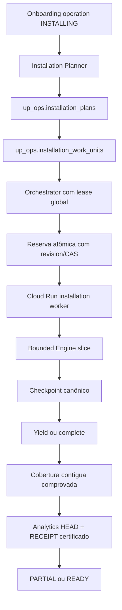

# CHANGE #18.3 — Installation Planner + Orchestrator V2

Implementação **offline**, baseada em `830353350cfaace4cadec3c69a994f8269b94bb6`, na branch `change-18-3-installation-orchestrator`. Não ativa sincronização normal, não altera a configuração DEV da MX e não executa fontes, jobs ou consultas reais.

## Arquitetura



BigQuery funciona como ledger durável, não como fila com polling concorrente de workers. Somente o orchestrator seleciona work. Cada worker recebe uma unidade, sob duas leases: `installation-work:<store>` e a lease canônica da store, compartilhada com a operação existente. O orchestrator usa `installation-orchestrator-global`. Nenhuma lease tem takeover automático por idade; resultado de escrita desconhecido preserva as leases conforme o contrato existente.

A admissão durável evolui os conceitos de `Admission`/`Budget` em `src/scale/proposal.py`: uma store ativa, teto global, reserva antes do IO e nenhuma devolução otimista de resultado ambíguo. Reutiliza os budgets reais `BoundedClient`, filtros canônicos, RAW, checkpoints, normalização e materializadores existentes. O modelo experimental in-memory da proposta não é uma segunda autoridade.

## Tabelas e CAS

Somente duas tabelas novas, sem alteração dos schemas existentes:

| Tabela | Conteúdo | Clustering |
| --- | --- | --- |
| `up_ops.installation_plans` | Identidade determinística, range, revisão do Registry, versão do planner, hash de configuração, evidência de cobertura | store_id, status |
| `up_ops.installation_work_units` | Dependências, espécie de trabalho, filtros allowlisted, revisão, tentativas/falhas, métricas, identidade de dispatch | store_id, status, plan_id, resource |

Ambas usam deletion protection do Terraform ativo. Não contêm payload da fonte, credenciais, PII ou cópia do cursor. `revision` é REQUIRED. SQL transacional verifica cardinalidade exatamente um, status, revisão, store/plan/token; não confia em PK BigQuery. O CAS do Registry ocorre na mesma transação do plan. Identidades determinísticas não permitem reinterpretar um grafo já persistido ao repetir o planner.

`reservation_revision` preserva a revisão do intent entregue ao worker. A gravação posterior do operation/execution name pode incrementar `revision` antes ou durante o worker. O claim valida token + revisão **da reserva**, e CAS usa a revisão atual, impedindo duas invocações sem rejeitar uma execução legítima por essa corrida de metadata.

## Planner e fontes

Novas instalações: onboarding `INSTALLING`, Registry `DRAFT`, `sync_enabled=false`. O planner não usa `BigQueryRegistry.eligible()`. A CLI descobre Registry/source connections/checkpoints/runs antes de criar o grafo. Adoção legacy exige `--adopt` explícito. Mudança de revisão/configuração depois do plan bloqueia a instalação antes de nova chamada à fonte.

B2B recebe `qualifying_order_statuses` explicitamente. Backend rejeita lista ausente/vazia/duplicada, status desconhecido ou CANCELED. A versão vem de `analytics.policy.VERSION`. O frontend pré-seleciona RESERVED, CONFIRMED, PROCESSING, INVOICED, SHIPPED, mas envia a lista; não existe default comercial implícito no backend. B2C-only não passa a ter Analytics B2B.

Adapters `SourcePlanner` e `SourceVerifier` isolam planejamento/verificação por fonte. Novos conectores exigem seu adapter, IAM e contrato, sem criar ERP/GA4/Nuvemshop/WhatsApp nesta entrega.

UP Zero: VERIFY_SOURCE, snapshot Customers, Orders/Facts por dia local e LEGACY_RESUME. Conexões novas pending exigem referência pinada do mesmo projeto e nome da própria store. Conexões active legadas reutilizam o guard existente de projeto/namespace/versão numérica, preservando o Secret ID já aprovado da MX; não há renomeação, rotação ou migração de credencial. Usa `planning.filters_for` e `ZoneInfo`: D 00:00 local e D+1 00:00 local convertidos independentemente para UTC. Há testes de dias com 23h/25h. Uma origem legacy dentro do dia é preservada; a primeira publicação começa na próxima data local completa. Orders tem filtros DATE da API, portanto o fetch do primeiro dia parcial pode abranger a data inteira; o recorte analítico continua explícito e não muda o filtro do checkpoint legado.

Meta: VERIFY_SOURCE, accounts → campaigns → adsets → ads, depois Insights diários. Usa o token global server-side pinado e binding aprovado; nenhum token por store. Mantém o contrato atual `impression`, `7d_click`, purchase_action não escolhido, sem inventar métricas de compra. Pending checkpoints Meta com configuração anterior são **BLOCKED para recuperação explícita**, não reiniciados automaticamente.

Verificação UP Zero: um probe Customers `limit=1`, pelo connector existente; não inventa health endpoint. Meta: probe da conta configurada. Descarta o payload, não captura RAW/CORE nem loga PII. Sucesso/falha definitiva atualiza source_connections + unidade atomicamente, validando status/updated_at anteriores. A capability verificada é apenas `customers` ou `accounts`, não uma alegação de acesso a todos os endpoints. A prova dos demais endpoints acontece durante o trabalho respectivo. A verificação ainda precisa de aceitação live futura autorizada.

## Lifecycle, slices e falhas

Plan: PLANNING/RUNNING/PARTIAL/COMPLETE/BLOCKED/OUTCOME_UNKNOWN. Work: PENDING/DISPATCHING/RUNNING/DEFERRED/COMPLETE/BLOCKED/DISPATCH_UNKNOWN/OUTCOME_UNKNOWN.

Antes de POST, reserva CAS PENDING/DEFERRED → DISPATCHING, incrementa attempt_count, fixa token/revisão. POST ocorre uma única vez. Resposta conhecida é persistida; operation e execution são consultadas separadamente, sem espera monolítica. Nome valida projeto/região/job antes de GET. Resposta perdida, crash entre intent e registro da operation ou estado durável ausente no final de execução não autorizam outro POST.

Claim: valida store/work/plan/pipeline/token/revisão, Registry e versão do planner, então DISPATCHING → RUNNING. Replay da mesma invocação falha fechado. SDKs/ADC só são construídos depois dos guards DEV da CLI.

`Engine.advance` e `MetaEngine.advance`: até 20 páginas por slice, soft budget até 600s. `Engine.run()` mantém o comportamento anterior por default. O connector Meta possui modo cooperativo interno, usado somente por advance, para preservar next cursor na página limite; o modo run continua rejeitando orçamento de paginação esgotado. O slice nunca trata fim do laço de paginação como source exhaustion.

Ordem preservada:

```text
fetch → RAW capture → pending_raw_id → CORE promotion
→ clear pending_raw_id → persist next position → yield ou complete
```

Yield só depois do commit da página completa. Run/checkpoint continuam running, finished_at NULL, work volta a PENDING. Uma nova execução retoma o mesmo run/cursor. Source exhaustion finaliza a unidade. Pending RAW é promovido antes de nova página de ingestão. Não há reset, replay automático ou alteração de filtros legados. O seed reutiliza stores/source_capabilities sem sobrescrever source_connections verificadas.

`attempt_count` conta execuções; `failure_count` conta somente falhas. 30 slices saudáveis não esgotam retries. Allowlist DEFERRED: retry_after_deferred, meta_retry_deferred, store_execution_budget_exhausted, analytics_execution_query_budget_exhausted. Backoff 60/120s e terceira falha BLOCKED; demais erros não classificados bloqueiam. Resultado BQ desconhecido tem precedência sobre erro posterior de budget: mantém RUNNING e leases como estado reconciliável, sem nova escrita/retry automático. Se o budget se esgotar antes da transição durável, também é necessária reconciliação; não se alega DEFERRED sem persistência comprovada.

O soft budget não interrompe uma página a meio. 600s não é timeout rígido nem SLO; páginas grandes e publicação Analytics podem durar mais. Timeout dos novos jobs permanece 3600s, max_retries=0. Benchmark DEV autorizado ainda é necessário.

## Adoção MX e cobertura

Fixture `tests/installation/fixtures/mx_legacy.json` é inteiramente sintética: quatro Customers recovered históricos, um snapshot/incremental fresco completo, Orders reconcile completo e Facts incremental running com 344 páginas/344.000 processados e cursor persistido. Contém também um HEAD certificado sintético, somente para inspeção offline. Não usa UUID, credencial, cliente ou payload reais.

Inspeção produz existing coverage, pending legacy units, new planned units, skipped completed windows e publication milestones. Completed evidence de Orders/Facts é reutilizada; pending amplo vira uma única LEGACY_RESUME, com run_id/plan_key/mode/filters originais, sem duplicar dias já cobertos por esse resume. Recovered Customers não prova freshness; pode exigir snapshot fresco. needs_review, identidade divergente, run não certificado ou configuração Meta pendente bloqueiam, nunca geram replay automático.

Cobertura é união **contígua** desde requested_from. `01→02, 02→03, 04→05` prova somente `01→03`; só o preenchimento do gap permite `01→05`. Registry facts_complete é verdadeiro apenas quando o range inteiro solicitado está provado. Nunca gera history_complete ou lifetime HistoryCoverage por terminar chunks.

Uma publicação legacy válida continua disponível durante adoção. O leitor valida HEAD/RECEIPT e flags reais do snapshot materializado (store_daily/funnel_daily), evitando confundir flags globais recém-adotadas com flags da geração existente. Milestones menores que o watermark certificado antigo são omitidos para não reduzir o período disponível; publicação final sempre permanece.

## Analytics parcial e READY

Primeiro dia completo certificado, depois sete novos dias e final obrigatório. Publicação depende de snapshot Customers/verification/Orders/Facts necessários ao prefixo. Reutiliza Prerequisites.upzero_complete, AnalyticsPolicy e materializador existentes, sem exigir ACTIVE. Publish units não pesam no percentual de dados; permanecem dependências/estado operacional. No prefixo, facts_complete permanece falso; final pode ser true. Lifetime continua parcial quando history_complete=false.

HEAD/RECEIPT é a autoridade do período visível. Sem certificado, work COMPLETE não libera Dashboard. O leitor V2 usa publicação consistente e flags armazenados; campos history-dependent seguem NULL. `--installation-v2` na composição server-side do preview habilita a policy dinâmica para as leituras comerciais; sem plan usa policy legacy. Não ativa automaticamente live nem muda demoApi. **Schema-first:** InstallationReader também consulta a tabela de plans para detectar fallback. Provisionar as duas tabelas/IAM antes de publicar o novo backend; tabela ausente é erro explícito, não fallback silencioso.

READY significa range solicitado instalado, fontes ativas, todas as unidades completas, publicação final válida e nenhum checkpoint pendente/ambiguidade. Registry fica READY, sync_enabled=false; nenhuma rotina normal seleciona a store. READY **não implica history_complete=true**. ACTIVE + daily sync fica para outra Change.

## Progresso e ETA

CHUNKS: required source units completas / total dessas unidades. Número de slices não muda denominador. Para 30 dias UP Zero novos, são 62: 1 verificação + 1 Customers + 30 Orders + 30 Facts; a exemplo de 61 etapas em UI é sintético, não constante de produto. Uma adoção com intervalos completos já reutilizados pode ter denominador menor, correspondente ao trabalho restante. Publicações têm peso zero; 100% de source work não é READY se a publicação final faltar.

Records/pages são somas dos contadores cumulativos de cada run/work, atualizadas por substituição após slice, não soma repetida de slices. São volume processado, não contagem de entidades únicas entre recursos/runs. ETA: por source/resource/kind, ao menos três unidades comparáveis concluídas, mediana das últimas dez × restantes; soma serial dos grupos. Sem evidência suficiente, NULL. UI diz Tempo estimado, não hora prometida nem SLA.

## Frontend e composição administrativa

Contrato installation.v2 adiciona plan ID/status, CHUNKS, work counts, records/pages. Parser aceita READY com history_complete=false somente com prova V2; V1 preserva compatibilidade. Polling 30s em INSTALLING/PARTIAL; para em READY/BLOCKED/OUTCOME_UNKNOWN. Exibe reconciliação e separa etapas de registros/páginas. Não expõe operation/execution/cursor ou valores de Secret Manager ao cliente.

OnboardingService recebe callback server-side opcional `installation(tenant,store)` na leitura da operação, **depois** de autorização ADMIN, ownership e tenant. A composição real deve ligar esse callback a InstallationReader autorizado; não usar identificadores enviados pelo browser para fabricar autorização. POST onboarding continua SAGA sem source probe/dispatch. A UI consulta readback autenticado, mantendo estado inicial sem plano como Instalando/Calculando progresso/Pendente.

Para abrir Dashboard de uma nova marca, ainda é necessário inventory/binding autorizado server-side na composição do workspace. Uma resposta installation não adiciona autorização à lista demo de marcas. True production authentication/inventory é trabalho futuro; nenhum grant é inventado neste change. B2C continua fora da Read API B2B.

## IAM, Terraform e limites V1

Quatro jobs (o enunciado diz três, mas lista quatro): orchestrator + UP Zero/Meta/Analytics workers. Mesma imagem futura imutável, `installation_image=null` por default: nenhum job é criado sem digest aprovado. Nenhum Scheduler foi adicionado. Tabelas, SA do orchestrator e grants são preparados no Terraform ativo, além dos recursos existentes; não há previsão de zero recursos adicionais nem um plan executado.

Workers reutilizam SAs source-specific. UP Zero/Meta recebem apenas work write + plan read + source_connections write para verificação; não Registry admin-wide write. Os acessos existentes de pipeline permanecem. Namespace UP Zero condicionado e Meta token global pinado são reutilizados, sem novo secret/IAM por store.

Orchestrator: BigQuery jobUser, reads de onboarding/Registry/source/checkpoints/runs/publications/flags, writer table-scoped para plans/work/Registry, custom lease role e RunJobWithOverrides apenas nos três jobs de instalação. Nenhum acesso Secret Manager. Read API requer metadata dataViewer das duas tabelas novas e os reads existentes, nunca writer; member administrativo opcional recebe read-only nelas.

Limites: global_parallel_store_limit=2, uma unidade por store, até 10 stores/20 dispatches por invocation, 20 páginas/600s por slice, 10.000 unidades por plan/leitura de ledger, range até 3.660 dias. Seleção/refresh é limitada a dez plans e dados históricos fora de plans ativos não são varridos. Backlog ativo acima de 10.000 linhas falha fechado; V1 requer waves menores ou futura paginação do ledger para installations extensas de centenas de stores. Não promete escala ilimitada.

Budgets existentes: maximum_bytes_billed=1GiB por query e maximum_total_bytes_billed=128GiB por execução nos defaults CLI; guards aplicados a reads/CAS/promotions/publicações. Usam bytes billed reais e reservas existentes. Nomes de job são determinísticos por identidade/revisão/transição; job_retry=None via transporte. Resultado desconhecido não dispara outro mutation job.

Logs allowlisted: plan_created/work_reserved/work_dispatched/slice_yielded/work_completed/plan_partial/plan_completed/plan_blocked, com store/plan/work/resource/source/estado/contadores seguros. Nenhum cursor/payload/credencial. Cloud Tasks/PubSub, paralelismo por fonte dentro da store e agendamento automático contínuo estão fora da V1.

## Comandos offline e adoção futura

Inspeção sintética, sem ADC/rede/alterações:

```bash
.venv/bin/python -m src.installation.cli \
  --plan-only --fixture tests/installation/fixtures/mx_legacy.json \
  --store-id synthetic-mx --adopt \
  --target-as-of 2026-10-01T03:00:00+00:00
```

Futura inspeção **somente leitura real**, NÃO executada nesta Change e dependente de autorização, tabelas/IAM/ADC DEV e lease administrativa previamente reconciliada. Usar um target explicitamente aprovado, não adivinhar o estado MX; store deve estar sync_enabled=false:

```bash
python -m src.installation.cli \
  --plan-only --adopt --store-id mx-fashion --confirm-store mx-fashion \
  --target-as-of "$APPROVED_INSTALLATION_TARGET_UTC" \
  --live --project up-data-intelligence-dev \
  --confirm-project up-data-intelligence-dev --project-number 876521886531 \
  --location southamerica-east1 \
  --lease-bucket up-data-intelligence-dev-876521886531-leases \
  --maximum-bytes-billed 1073741824 \
  --maximum-total-bytes-billed 137438953472
```

`--plan-only` não reserva lease, não faz DML, source probe, Secret read ou POST; somente metadata/head/flags. `--create-plan` é MUTATION futura separada, sob leases global+store. `--dispatch` é MUTATION futura e exige os mesmos guards live/DEV/confirm-store/project. Não executar nenhum deles agora. A CLI V1 é scoped a uma store por chamada; o domínio suporta múltiplas stores/cap global. Sem Scheduler, onboarding automático só avança quando o orchestrator é futuramente invocado; não existe um trigger live nesta entrega.

Ordem posterior: revisão/auditoria da branch → autorização de provisionamento metadata/IAM → imagem com código novo aprovada → plan Terraform revisado → ativação manual do runtime somente após apply autorizado → plan-only MX com dados reais → revisão da adoção e reconciliação de leases/outcomes → create-plan autorizado → dispatch controlado → validação de prefixo/HEAD/counters → READY sem ACTIVE automático. Não resetar checkpoint, limpar RAW, liberar lock ou repetir POST por suposição.

## Validação offline

```bash
.venv/bin/pytest -q
.venv/bin/ruff check .
.venv/bin/ruff format --check .
.venv/bin/mypy src
(cd frontend && npm test -- --run && npm run lint && npm run typecheck && npm run format:check && npm run build)
terraform fmt -check -recursive infra/terraform
terraform -chdir=infra/terraform validate
git diff --check
```

E2E dedicado só localhost e fixtures, servidor iniciado/verificado separadamente:

```bash
cd frontend
NEXT_TELEMETRY_DISABLED=1 DASHBOARD_E2E_LIVE=0 DASHBOARD_OFFLINE_TEST=1 \
DASHBOARD_DATA_MODE=read-api-preview DASHBOARD_READ_API_BASE_URL='' \
DASHBOARD_DEV_PREVIEW_TOKEN='' UP_ADMIN_ONBOARDING_DEV=1 \
UP_ADMIN_API_BASE_URL='' UP_ADMIN_DEV_TOKEN='' \
node node_modules/next/dist/bin/next dev --hostname 127.0.0.1 --port 3117
# Outro terminal; Chrome/Playwright instalado localmente:
DASHBOARD_E2E_LIVE=0 PLAYWRIGHT_CHROMIUM_EXECUTABLE='/Applications/Google Chrome.app/Contents/MacOS/Google Chrome' \
./node_modules/.bin/playwright test --config=playwright.installation.config.ts
```

Suite inclui teste explícito de 350 páginas/350.000 Facts no Engine real com transport mock e repository sintético compacto: 18 workers reconstruídos, um run/checkpoint/work, 350 RAW identities, 350.000 CORE identities, nenhum reset/replay/duplicação. O storage compacto descarta somente payloads sintéticos antigos após promoção; os testes canônicos existentes de RAW integral continuam na suíte. Há testes de pending RAW, boundary por tempo, CAS/duplicate invocation, dispatch desconhecido, Meta cursor, retries, config change, gaps/DST, progresso/ETA, partial/READY sem lifetime e autorização readback. SQL novo recebe testes estruturais; aceitação BigQuery live ainda não ocorreu.

Nenhuma operação GCP/Secret Manager/UP Zero/Meta/Cloud Run/BigQuery live, plan/apply, scheduler ou MX live foi executada nesta Change.

## Resultados nesta branch

- Python full suite: **2.027 passed in 133.66s**, com rede negada por fixture autouse. Ruff check/format e mypy (150 arquivos source) passaram.
- Frontend: 219 testes em 21 arquivos; lint/typecheck/Prettier passaram.
- E2E: oito testes offline passaram em 5,8s, incluindo Installation V2 INSTALLING/PARTIAL/READY/OUTCOME_UNKNOWN e onboarding compatível.
- Build local: `npm run build -- --webpack` passou (45 páginas). `npm run build` com Turbopack não progrediu no sandbox e foi interrompido; não foi considerado validado. Não houve mudança do bundler no projeto.
- Terraform fmt/check e validate passaram; validate precisou permitir apenas o socket local do provider instalado. Sem init/plan/apply/GCP.
- Auditoria estática: 118 chunks JavaScript de cliente, sem valores privados do ambiente local, referências server-side de secrets ou private keys. Nenhum arquivo sensível/temporário selecionado.

## Files changed

Lista completa relativa à raiz do repositório, incluindo este documento:

- `README.md`
- `docs/CHANGE_18_3_INSTALLATION_ORCHESTRATOR.md`
- `frontend/playwright.installation.config.ts`
- `frontend/src/components/installation-state.tsx`
- `frontend/src/features/brand-integrations.tsx`
- `frontend/src/features/secure-onboarding.tsx`
- `frontend/src/services/api/installation.ts`
- `frontend/src/services/api/onboarding.ts`
- `frontend/src/types/installation.ts`
- `frontend/src/types/onboarding.ts`
- `frontend/tests/e2e/installation.spec.ts`
- `frontend/tests/e2e/onboarding.spec.ts`
- `frontend/tests/fixtures/installation.ts`
- `frontend/tests/fixtures/onboarding.ts`
- `frontend/tests/installation-v2.test.ts`
- `infra/terraform/control_plane.tf`
- `infra/terraform/installation.tf`
- `infra/terraform/schemas/installation_plans.json`
- `infra/terraform/schemas/installation_work_units.json`
- `infra/terraform/tables.json`
- `sql/ops/installation_plans.sql`
- `sql/ops/installation_work_units.sql`
- `src/admin/contracts.py`
- `src/admin/service.py`
- `src/bigquery/catalog.py`
- `src/bigquery/schema.py`
- `src/connectors/meta/client.py`
- `src/dashboard/dev_preview_server.py`
- `src/dashboard/installation.py`
- `src/dashboard/installation_queries.py`
- `src/dashboard/service.py`
- `src/ingestion/engine.py`
- `src/ingestion/meta.py`
- `src/ingestion/meta_live.py`
- `src/installation/__init__.py`
- `src/installation/adapters.py`
- `src/installation/adoption.py`
- `src/installation/cli.py`
- `src/installation/gateway.py`
- `src/installation/model.py`
- `src/installation/orchestrator.py`
- `src/installation/planner.py`
- `src/installation/progress.py`
- `src/installation/publication.py`
- `src/installation/repository.py`
- `src/installation/schema.py`
- `src/installation/worker.py`
- `src/observability/logging.py`
- `tests/admin/test_onboarding.py`
- `tests/change16/test_stack.py`
- `tests/control_plane/test_control_plane.py`
- `tests/dashboard/test_installation.py`
- `tests/installation/__init__.py`
- `tests/installation/fakes.py`
- `tests/installation/fixtures/mx_legacy.json`
- `tests/installation/test_adapters.py`
- `tests/installation/test_persistence.py`
- `tests/installation/test_planner.py`
- `tests/installation/test_read_model.py`
- `tests/installation/test_runtime.py`
- `tests/installation/test_slices.py`
