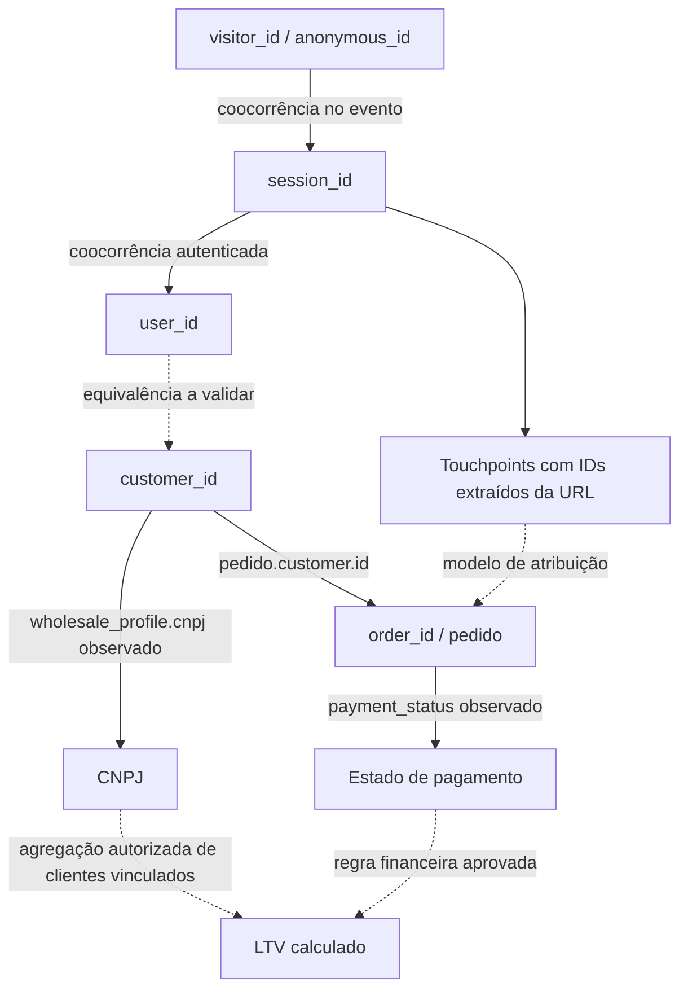

# Modelo de dados, identidade e atribuição

> Evolução preparada: [Identity Hardening](IDENTITY_HARDENING.md) distingue o modelo ativo, as adições 1.1.0 e a separação futura dos snapshots. [Migração sem perda](IDENTITY_MIGRATION_PLAN.md).

Status: modelo de referência aprovado; subconjunto da Fase 1 implementado. Revisão: 2026-09-28.

**Escopo implementado:** customers/orders/order_items e versões, analytics_events e versões, touchpoints, identity_links e event_order_links. Sessões agregadas, business_links/CNPJ consolidado e todos os cálculos abaixo permanecem futuros. RAW agora é sanitizado por decisão aprovada; [SECURITY](SECURITY.md) e [BIGQUERY_SCHEMA](BIGQUERY_SCHEMA.md) definem o contrato físico vigente.

Fonte oficial: [docs/upzero-openapi.json](upzero-openapi.json), OpenAPI 3.1.0, API 1.0.0. **Contrato** = documentado no arquivo; **observado** = testes reais relatados pelo usuário, não repetidos nesta análise; **transformado** = derivado de dados preservados; **calculado** = métrica ou atribuição sujeita a regras versionadas; **proposto** = decisão ainda não implantada.

## 1. Três classes de dado
| Classe | Exemplos | Regra |
|---|---|---|
| Observado/contratado | Fact.id, occurred_at, visitor_id, session_id, user_id, order_id; pedido.customer.id; wholesale_profile.cnpj; payment_status | Preservar resposta sanitizada e referência da coleta |
| Transformado | IDs em STRING, CNPJ normalizado, campaign_id extraído de landing_url, sessões e vínculos de identidade | Registrar transformação, versão e evidência; não chamar de campo nativo |
| Calculado | Atribuição, novo cliente, CAC, LTV, retenção, ROI | Registrar política, janela, denominador, cobertura, moeda e data de cálculo |

store_id é enriquecimento técnico do contexto autenticado. Não é propriedade de AnalyticsFactItem. IDs são únicos apenas no escopo confirmado; toda chave usa loja, fonte e identificador. Valores com mesmo texto em namespaces distintos não são a mesma identidade.

## 2. Caminho desejado e evidência de cada ligação

CNPJ não determina um order_id diretamente: a ligação passa pelo cliente do pedido. Um CNPJ pode ter vários cadastros; um cadastro pode mudar de CNPJ. Usuários varejo podem não ter CNPJ. `user_id = customer_id` é hipótese pendente, não join autorizado por coincidência numérica.

| Ligação | Evidência aceitável | Proteção contra associação indevida |
|---|---|---|
| visitor/anonymous ↔ session | IDs presentes no mesmo fact da mesma loja | Não fundir visitantes permanentemente porque compartilharam sessão/dispositivo |
| session ↔ user | Coocorrência em evento; semântica de autenticação a confirmar | Sessão pode conter troca de login; guardar relações por evento/tempo |
| user ↔ customer | Contrato confirmado pela UP Zero e amostras verificadas | Até confirmação, vínculo unresolved; nunca por nome, email parecido ou ID igual isolado |
| customer ↔ CNPJ | wholesale_profile.cnpj do cliente ou snapshot customer no pedido | Manter origem, divergência e histórico; não inferir por URL |
| event ↔ order | fact.order_id e pedido.id na mesma loja | Preservar órfão e reconsultar pedido; não ligar por valor/horário aproximado |
| order ↔ customer | OrderResponse.customer.id | Pode ser nulo; manter pedido mesmo sem identidade resolvida |
| order ↔ pagamento | payment_status/payment_method/installments no pedido | Não há payment_id, paid_at, parcelas liquidadas ou ledger de reembolsos documentados |

## 3. Histórico sem sobrescrever evidência
RAW sanitizado é append-only dentro da retenção aprovada. CORE mantém versões de clientes, pedidos, itens e vínculos, com source_updated_at quando existe, observed_at, version_id, raw_record_id e hash do conteúdo. customer não tem updated_at no schema de resposta: suas versões representam alterações observadas, não tempo real da alteração.

identity_links contém left_namespace/id, right_namespace/id, evidence_event_id ou raw_record_id, rule_version, observed_at, status (candidate/confirmed/rejected/ambiguous) e supersedes_link_id. Vínculos podem ser revogados sem apagar versões passadas, exceto exclusões exigidas pela política de dados. Manter tempo do evento e tempo de conhecimento separados; atribuição deve declarar se permite usar vínculo descoberto após a compra.

Mudança de CNPJ cria nova observação; não reatribuir retroativamente todos os pedidos. CNPJ do snapshot do pedido representa o que a API retornou naquele momento, sem garantia de ser cópia imutável do checkout. Para CNPJ atual versus CNPJ associado à compra, oferecer visões distintas com evidência. Normalizar pontuação/espaços sem conversão numérica; preservar valor original em RAW. Validade cadastral/formato é regra versionada, não comprovação de identidade. Não agrupar automaticamente por raiz de CNPJ ou entre lojas.

Sessões usam session_id fornecido; não inventar sessão de 30 minutos quando ausente. Nesse caso, manter evento não sessionizado. first_seen_at/last_seen_at e event_count são derivados das observações; sessão pode estar incompleta pela retenção. Eventos atrasados atualizam resumo e versionam resultados dependentes.

## 4. Touchpoints e parâmetros Meta
Extrair da query de landing_url: campaign_id, adset_id, ad_id e adset_name, preservando como strings e mantendo URL sanitizada em RAW e CORE restritos. Registrar parser_version, source_fact_id, parse_status e parâmetros duplicados/conflitantes. Fazer decodificação padrão uma vez; rejeitar URL inválida e placeholders não substituídos como IDs confiáveis. Não escolher silenciosamente entre valores conflitantes. Nome do conjunto é rótulo observado, não chave.

fbclid, fbc e fbp não são ad_id e não permitem por si sós derivar campanha/anúncio. gclid não é campaign_id. UTMs não garantem identidade de mídia. IDs de URL são alegações observadas, sujeitas a adulteração; cruzamento futuro com conta publicitária autorizada confirma existência/hierarquia, sem provar causalidade.

Um touchpoint inicial representa um fact com contexto de origem útil, referenciado pelo ID do fact. Redução para uma chegada por sessão será regra explícita para não dar mais crédito a campanhas com mais eventos instrumentados. Manter tráfego sem mídia e origem desconhecida; “sem atribuição” não equivale a orgânico.

Meta deve futuramente enriquecer entidades e gasto por conta/campanha/conjunto/anúncio e período, conforme contrato a descobrir. Manter platform + ad_account_id + source_id e histórico dos nomes. Conta compartilhada exige tabela de alocação aprovada; nunca replicar gasto inteiro em cada loja.

## 5. Evolução de purchase e purchase_item
Hoje, ausência de order_id é defeito observado pelo usuário. Planejado: preencher os dois eventos. Registrar início de vigência confirmado por loja, capacidade da integração e eventual intervalo de backfill. Reprocessar RAW e/ou reconsultar a fonte quando corrigida; conservar versão anterior e evidência da nova.

Sem backfill, eventos antigos continuam unresolved. Não atribuir por valor ou proximidade temporal. order_id não é chave única de evento: purchase_item pode ter várias linhas/eventos por pedido. O schema de facts não inclui order_item_id; não ligar item ao item comercial só por produto, pois o produto pode se repetir. A fonte de valor de pedido será orders; não somar purchase.value com purchase_item.value para receita.

## 6. Métricas futuras — fora da Fase 1
| Métrica | Definição candidata | Dependências / limitação |
|---|---|---|
| customer_ltv | Soma do valor elegível de pedidos distintos por cliente até as_of_date, em janela definida | Versão de política para pago/cancelado/estornado; cobertura histórica, moeda e frete |
| campaign_ltv | LTV dos clientes adquiridos atribuídos à campanha, com pesos de aquisição congelados/versionados | Separar atribuição de aquisição da atribuição de cada recompra |
| CAC de mídia | Gasto de aquisição alocado / novos clientes atribuídos (ou soma dos pesos) na mesma política | Gasto Meta ainda ausente; denominador zero = NULL; CAC total requer demais custos |
| Retenção de coorte | Clientes da coorte que recompraram no período / clientes elegíveis da coorte | Coortes maduras e cobertura; recompra = pedido distinto elegível |
| ROAS de receita | Receita atribuída / gasto | Não chamar de lucro nem ROI |
| ROI de margem | (Margem de contribuição antes de marketing atribuída − investimento de marketing) / investimento | Faltam custos históricos, estornos, impostos/taxas e política de alocação |

Primeiro pedido observado não prova primeira compra histórica. Sinalizar left_censored quando backfill for insuficiente. Custo atual de VariantResponse.cost não representa custo histórico da venda. payment_status=paid é estado observado, não comprovação de liquidação financeira. Mesmo após corrigir order_id, “CAC/ROI real” exige fontes e definições financeiras adicionais.

Proposta para revisão: comparar first-touch e last non-direct em janela configurável, mantendo model_version e peso por pedido/touchpoint. Não escolher janela arbitrária como fato. Pesos devem totalizar 1 por pedido atribuível/modelo; restante não atribuível permanece explícito. Distinct users/sessions em metrics não são somáveis entre dimensões/períodos.
