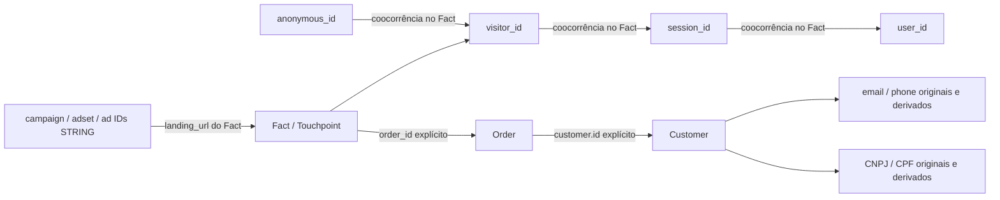

# Data Model & Identity Hardening

> Escopo aprovado: somente expansão aditiva. Separação física de snapshots/ReceitaWS, up_identity, remoções e mudanças IAM estão adiadas. Aprovação do código não autoriza executar migration/apply/build/deploy/backfill.

Status: código local preparado, sem deploy, migration, Terraform plan/apply, execução de Jobs ou acesso a dados reais. Contrato: `docs/upzero-openapi.json`; observações DEV são as informadas pelo responsável, não uma nova auditoria live. Os testes usam apenas dados sintéticos. Este documento complementa o DATA_MODEL original e registra os limites da evolução 1.1.0.

## Auditoria e mapa de identidade

Não existe aresta comprovada `user_id = customer_id`. IDs iguais entre namespaces não são evidência. Cada relação usa `store_id + source_system + tipo + ID`; a conexão UP Zero ativa por loja continua única. Uma sessão/contato compartilhado não permite fundir pessoas. `external_ref.integration + external_id` representa referência ao sistema externo, não ao usuário de analytics.

A cadeia comercial comprovada é Fact.order_id → Order.customer.id → Customer.id. Ela identifica o cliente associado ao pedido, não o autor autenticado do evento. Referências ausentes ficam pendentes; o resolver exige exatamente um pedido e um cliente da mesma loja/fonte. Clientes podem ser múltiplos para um mesmo CNPJ: não deduplicar cadastros por CNPJ automaticamente.

`resolve_customer` é função pura e `sql/identity/resolved_event_customer.sql` uma consulta proposta: ainda não foram integrados a Jobs nem publicados como view. A resolução é dinâmica, portanto chegada tardia de pedidos/clientes pode resolver eventos e touchpoints sem copiar contatos ou reescrever todos os eventos. Para histórico, usar as versões e uma política temporal explícita; a consulta proposta usa o cliente **corrente** do pedido e devolve IDs de versão.

## Problemas encontrados

- `orders` e `orders_versions` duplicam `customer_snapshot` e `shipping_address`, incluindo contato, endereço e metadados empresariais. Cada nova versão repete os JSONs.
- Customers também preservam profiles JSON e alguns campos extraídos; isso é mantido para não perder informações, mas exige acesso restrito.
- `identity_links` tinha apenas três pares de coocorrência de analytics, com nomes left/right e sem metadados explícitos de confiança e entidade fonte.
- Customer não possuía derivados para normalização; não há contrato para relacionamento direto analytics.user_id → customer.id.
- Events/touchpoints já usam allowlist sem colunas cadastrais, mas landing_url, referrer e UTMs livres **podem conter PII**. Preservá-los no CORE restrito e expor projeções revisadas na camada analítica.

## Customer central: observado, transformado e calculado

| Categoria | Campos / decisão |
|---|---|
| Observado, preservado | customer_id, customer_type, status, name, email, phone, CPF de retail_profile, CNPJ/company_name/trade_name de wholesale_profile, seller e ambos profiles |
| Observado, agora projetado | external_ref; seller_id de seller.id; state/city do profile correspondente a customer_type |
| Transformado, adicional | email_normalized, phone_normalized, phone_e164, cnpj_digits, cpf_digits; versão e issues da normalização |
| Linhagem técnica | store_id, source_system, raw_record_id, run_id, observed_at, payload_hash, version_id, transform_version e source_updated_at quando suportado |
| Não implementado por falta de prova | user_id do cliente, created_at/updated_at do CustomerResponse, campos tipados de ReceitaWS |
| Calculado, futuro | Customer 360, LTV, cohorts, atribuição, receita paga e métricas derivadas |

CustomerResponse não documenta created_at/updated_at/user_id. Campos de CustomerCreateRequest não provam que o endpoint de leitura os retorna. Não converter observed_at em data de cadastro. `source_updated_at` pode permanecer nulo. Datas de Orders são documentadas e continuam preservadas.

## Regras de normalização 1.0.0

- Email: trim + lowercase; original intacto. Formato obviamente inválido gera issue e não autoriza matching automático. Sem remoção de pontos/aliases ou validação de titularidade.
- CNPJ/CPF: remover apenas formatação numérica conhecida; preservar zeros iniciais como STRING. Letras, tipos não textuais e caracteres desconhecidos deixam derivado nulo e issue; original preservado. Comprimento inesperado gera issue, mas dígitos permanecem. Não há validação de dígitos verificadores nem conversão de CNPJ alfanumérico: casos não suportados não são descartados.
- Phone: remover espaços, parênteses, hífen e ponto quando toda a entrada obedece ao formato. Ramais/letras geram issue e derivado nulo. Sem inferir país a partir de timezone/loja. Prefixo `00` não vira `+`. phone_e164 só para `+` explícito seguido de 8–15 dígitos, primeiro não zero; é normalização sintática, não validação de plano nacional, titularidade ou capacidade WhatsApp.
- State/city: endereço cadastral wholesale para WHOLESALE, retail para RETAIL; tipo desconhecido não escolhe silenciosamente outro profile. Nunca é tratado como endereço de entrega.
- Originals não são substituídos por hashes. Futuras versões hash serão campos adicionais e terão política própria. Derivados inválidos/compartilhados não provam equivalência de pessoas.

## Orders e histórico: alternativa B

Escolha: tabela histórica restrita proposta `up_identity.order_party_snapshots`, uma linha por versão de pedido, com snapshot do cliente e endereço de entrega sanitizados. `up_core.orders_v2` será a fact comercial corrente e sua tabela de versões também será comercial. Esses destinos **não foram adicionados ao catálogo/Terraform**, pois precisam de aprovação e migração dos dados existentes.

A separação futura deverá preservar: mantém metadados de linhagem, order_id/customer_id, status, pagamentos, installments, datas, subtotal/discount/shipping/total, requested/fulfilled totals e quantidades, items_count; `item_ids` permanece para reconciliação de itens removidos. Valores solicitados, atendidos e total não são intercambiáveis; RESERVED/unpaid não é receita recebida.

O snapshot proposto usa version_id como row_key e mantém store_id, source_system, order_id, customer_id, raw_record_id, run_id e metadados de versão. A origem imutável é a versão do pedido, não o cadastro corrente: nunca reconstruir um snapshot antigo juntando Customer atual. RAW-only (A) não basta, pois RAW tem retenção de 365 dias. Orders_versions (C) mantém histórico, mas perpetua exposição de PII junto à fact comercial. Por segurança, **neste patch Orders/Orders_versions ainda preservam os JSONs legados** até a migração aprovada; não houve redução física dessas colunas.

Shipping completo permanece no RAW e, após aprovação, no snapshot restrito. A fact poderá receber shipping_state/shipping_city e eventualmente região/ZIP parcial só após validar os nomes e semântica do objeto livre shipping_address. O OpenAPI não permite inventar esse mapeamento. Não copiar billing city/state como se fosse shipping.

## ReceitaWS / business enrichment

Preservar JSON original sanitizado em RAW e snapshots; profiles do Customer continuam preservados. O contrato só garante `meta` JSON livre; não documenta caminho, schema, data de consulta ou precedência ReceitaWS. A observação humana confirma existência do conteúdo, mas não permite mapear CNAE/QSA/Simples automaticamente.

Proposta futura: `up_identity.customer_business_profiles` com versões, ligado a store/source/customer, CNPJ observado, fonte, observed_at da captura e caminhos de linhagem. Campos primary_cnae, descrição, secondary_cnaes, status, porte, opened_at, simples_optante só após inventário sanitizado de **nomes/tipos/caminhos**, não cópia pública do payload. Distinguir data da ingestão e data do enriquecimento; não atribuir a data da primeira à segunda. Enrichment observado apenas em Order não sobrescreve cadastro Customer sem política de precedência. QSA permanece histórico restrito e não integra facts nem views gerais.

## Identity links aditivos

Mantidos left_namespace/left_id/right_namespace/right_id para compatibilidade. Adicionados aliases identifier_type_from/value_from/type_to/value_to, confidence_type, source_entity_type/id, first_seen_at/last_seen_at. `source_fact_id` é preenchido só para fatos; em arestas de pedido é nulo, com source_entity_id=order_id.

Novas evidências persistidas pelo transformador: fact_id → order_id (`observed_fact_order`) e order_id → customer_id (`observed_order_customer`). Os três pares anteriores permanecem `observed_cooccurrence`. Confiança DETERMINISTIC significa observação explícita da relação, **não igualdade de pessoas**. Sem matching probabilístico nem fechamento transitivo de identidade.

Evidências são versionadas; first_seen_at=last_seen_at=observed_at representa a captura daquela versão, não toda a vida do vínculo. Eventos repetidos sem mudança não atualizam esses limites. Futuro agregado deve usar MIN/MAX por tenant/fonte/par/semântica, nunca expor isso como tempo real de criação da identidade. occurred_at guarda tempo do Fact (ou created_at do pedido).

Correções não apagam evidências históricas: consumo corrente deve filtrar source_version_id pela entidade corrente. `sql/identity/current_identity_links.sql` propõe esse filtro inclusive para arestas antigas sem source_entity_type. Não juntar toda identity_links indiscriminadamente a analytics: isso reativaria vínculos corrigidos. Contacts/CNPJ/CPF ficam centralizados em Customer; não replicados em cada aresta. Media IDs continuam STRING preservando zeros e nunca usam nome como chave. fbclid/fbc/fbp/gclid e UTMs permanecem no evento/touchpoint para joins futuros com mídia, sem integração Meta nesta etapa.

## Validação e limite operacional

Testes sintéticos cobrem normalização/original, ambiguidades, pedido reservado e não pago, joins, tenants, preservação RAW, preservação dos snapshots atuais, IDs de mídia, resolução tardia, replay, secrets e logs. Testes locais não validam um plano BigQuery real ou o conteúdo cadastral da MX Fashion. Ver `IDENTITY_MIGRATION_PLAN.md` para aprovação, ordem das mudanças e critérios de liberação antes do backfill. Ver `DATA_CLASSIFICATION.md` para acesso e classificação.

### Resultado local desta entrega

- `.venv/bin/pytest -q -W error::FutureWarning`: **136 passed**, incluindo 16 novos casos parametrizados/integração; rede bloqueada pela suíte.
- `.venv/bin/ruff check src tests scripts`: aprovado.
- `.venv/bin/ruff format --check src tests scripts`: 48 arquivos formatados.
- `.venv/bin/mypy src scripts`: aprovado, 37 arquivos.
- `git diff --check`: aprovado.
- Schemas comparados ao HEAD: somente 31 colunas NULLABLE adicionais; nenhum campo anterior removido/retipado. API OpenAPI e dev.tfvars não alterados.
- Nenhum teste BigQuery live, execução de SQL, Terraform plan/apply, migration, build, deploy realizado nesta etapa. O resultado não substitui a validação DEV aprovada após a migração.

- Revisão da expansão aprovada: `terraform fmt -recursive` e `terraform validate` aprovados. Validate precisou executar o provider local fora do sandbox; nenhum acesso ao state remoto/plan foi solicitado.
