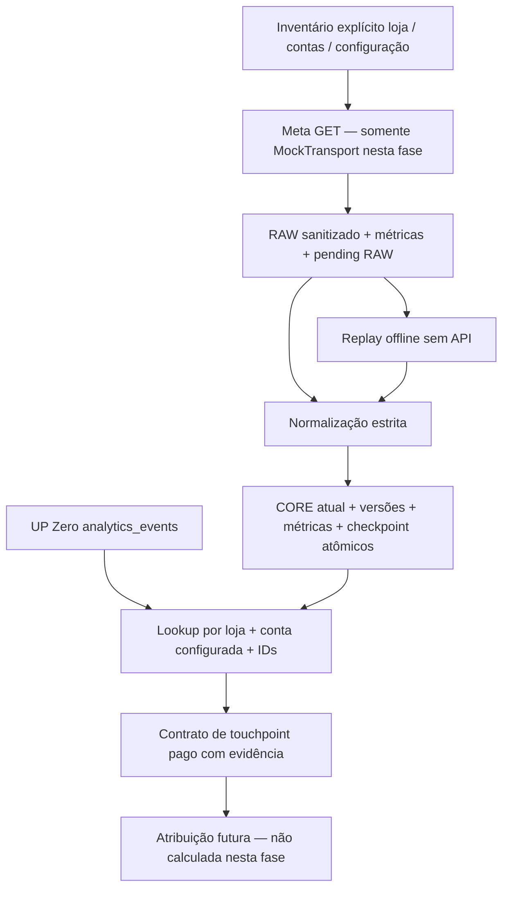

# Fundação Meta Ads e futura atribuição — preparação offline

Status: código e proposta aditiva de schemas, **sem integração live**, sem nova imagem,
sem mudança no DEV.4 ou na configuração MX Fashion. Nenhum comando GCP, Terraform,
Cloud Run, Scheduler, migration, build, deploy ou backfill faz parte desta entrega.

## Arquitetura encontrada e decisões

A Data Foundation existente oferece `Page`, `Batch`, `Repository`, adaptadores SQLite e
BigQuery, escrita BigQuery atômica por session/temp tables, métricas duráveis por estágio,
RAW antes de CORE, versões históricas e checkpoints com `pending_raw_id`. O CLI UP Zero
adquire lease por loja, lê credenciais e executa seu quality gate por recurso.

A extensão reutiliza essas abstrações e o logger com allowlist. `MetaEngine` adapta
normalização, rotas e paginação da Meta aos mesmos repositórios, tabelas operacionais,
contadores e transações. Não substitui nem modifica o Engine, CLI, parser ou gate UP Zero.
Os recursos operacionais Meta têm nomes `meta_accounts`, `meta_campaigns`, `meta_adsets`,
`meta_ads`, `meta_insights_daily`, sem colisão com recursos UP Zero.

Não há novo entrypoint de produção: o conector rejeita qualquer transporte que não seja
`httpx.MockTransport`. O runner exige uma factory de lease; a futura integração deve usar
**o mesmo lock por loja** já utilizado por UP Zero, não criar um namespace Meta independente.
Os testes usam `local_lease`; nada instancia `cloud_lease` ou clientes GCP nesta entrega.

## API de leitura e configuração

Rotas preparadas: GET `/{version}/act_{account_id}` para uma conta explicitamente autorizada,
e edges `/campaigns`, `/adsets`, `/ads`, `/insights`. Não enumeramos todas as contas visíveis
ao token. Não existem métodos de criação/edição, uploads ou Conversions API.

Cada `Account` exige store_id, account_id, connection_id, api_version, timezone IANA e
currency ISO textual. Todos os IDs Meta são strings de dígitos; inteiros são rejeitados,
zeros à esquerda preservados. O prefixo `act_` pertence apenas à rota/ID do nó Account.

O inventário completo é validado: uma loja pode ter várias contas; uma conta deve ter um
único dono configurado. Esse inventário é a autoridade de ownership. Não usar o campo
legado singular `stores.meta_ad_account_id`; não criar relações automáticas por token ou nome.
`meta_account_bindings` registra a configuração usada, e cada RAW preserva seu snapshot.
Não há restrição global UNIQUE do BigQuery: o futuro loader de configuração deve fornecer
sempre o inventário completo e impedir reassociação silenciosa entre lojas.

Insights exige intervalo de datas inclusivo, `level=ad`, `time_increment=1`, action_report_time,
action_attribution_windows e escolha explícita de purchase_action_type (pode ser `None`,
deixando as métricas de purchase derivadas NULL). Nenhuma janela comercial first-party é
assumida. A allowlist inicial de breakdowns é limitada; cada combinação deve ser validada
na versão real escolhida. Configuração não contém token.

`page_limit` é configurável. Páginas vazias com next cursor continuam sendo percorridas;
não presumimos fim por tamanho de página. Nunca seguimos `paging.next`: extraímos o cursor
e reconstruímos a mesma rota/conta/version, com token apenas no Authorization header.
Loop, cursor ausente/redigido e limite de páginas deixam evidência RAW e impedem avanço.
Retries limitados tratam transporte, HTTP 429 e 5xx com backoff e Retry-After limitado;
autorização/erro de contrato não é repetido automaticamente dentro da tentativa. Não existe
alegação de compatibilidade live com todos os códigos transitórios Graph: requer validação
antes de habilitar transporte real, além de jitter/quota adaptativa e Insights assíncrono.

## RAW, recuperação e idempotência

Cada envelope guarda resposta original **sanitizada** em `payload.response`; `payload.data`
é um adaptador uniforme (Account, que é um objeto, torna-se lista de um elemento). Todas
as respostas HTTP da sequência de tentativas são preservadas em `payload.http_attempts`,
com status e body sanitizado, inclusive erro final. A captura dessa sequência ocorre ao
terminar a chamada: uma queda de processo antes do retorno não é um journal HTTP durável.
Falha de transporte sem resposta fica como erro técnico, nunca como resposta inventada.
Headers de autenticação não são persistidos. `bytes_read` inclui bytes das respostas das
tentativas; bytes persistidos sanitizados são contados separadamente por `raw_payload_bytes`.
A duplicação estrutural response/data/audit aumenta o volume: medir antes de uso live.

A primeira transação grava envelope RAW + métricas de captura + checkpoint pendente.
Depois, uma transação grava CORE atual + versões + qualidade + métricas de promoção + avanço
do cursor. A página é indivisível para promoção: campo inválido bloqueia a página inteira,
sem perder os registros válidos que continuam no RAW. O writer existente pode subdividir
transporte BigQuery, preservando a transação de promoção final.

Falha após RAW: retry promove o RAW pendente antes de chamar API. Resultado BigQuery incerto:
o runner não sobregrava métricas com um estado presumido; a próxima tentativa relê checkpoint.
Erro HTTP sem dados preserva auditoria, deixa o cursor intacto e permite nova chamada no retry.
Erro de paginação com dados exige revisão: não descartamos o checkpoint pendente para forçar
refresh. A recuperação de cursor expirado/loop e criação de novo scan após revisão precisa de
procedimento operacional aprovado antes do live. Não alterar RAW para contornar o erro.

`refresh=True` só inicia nova extração após checkpoint completo. Replay usa o RAW e sua
configuração, não faz HTTP, não avança checkpoints de extração e não sobrescreve observação
mais recente com uma antiga. RAW de chamadas falhas sem dados exige retry de sync, não replay.
Replaying uma página com erro de validação exige corrigir a causa; a falha continua auditada.
Depois de replay corretivo, retry do sync original reaplica idempotentemente a página e avança
seu checkpoint. Uma configuração de conta diferente da RAW bloqueia replay para revisão.

Chaves de entidades: hash de store + source=`meta` + account + ID textual. Chave de Insights:
store + source + account + ad + date_start/date_stop + hash da configuração + valores dos
breakdowns. O hash inclui API version, timezone, moeda, nível, granularidade, action report time,
janelas e seleção de purchase, **não** intervalo consultado nem page-limit. Por isso consultas
sobrepostas atualizam a mesma chave. Versões têm hash da chave, RAW, payload e versão do
transformador. A observação mais nova prevalece; updated_time regressivo não sobrescreve CORE.
Ausência numa resposta não é deleção e não é zero. Reconsultas com mudança de granularidade
ou configuração não devem ser somadas com relatórios antigos. Ainda falta definir reconciliação
para linhas antes presentes que desapareçam em um refresh completo.

## Métricas e classificação

- Observado: IDs, nomes/status, timestamps da Meta, métricas de Insights e arrays originais
  actions/action_values. RAW preserva os valores sanitizados recebidos, não campos inferidos.
- Transformado: tipos STRING/NUMERIC/DATE, timestamps UTC, chave lógica, configuração,
  versão/linhagem; landing_page_views seleciona exatamente action_type=`landing_page_view`.
- Calculado/derivado: `meta_reported_purchases` e `meta_reported_purchase_value` selecionam
  **uma** categoria configurada nos arrays. Nunca somar purchase, omni_purchase e categorias
  sobrepostas; duplicidade de categoria é bloqueante. Ausência é NULL, não zero presumido.
- Futuro first-party: `first_party_orders`, `first_party_revenue_generated`,
  `first_party_revenue_paid`; não existem substituições dessas métricas por números Meta.

NUMERIC preserva até nove casas sem float para spend/valores. Contadores são INT64
não negativos. Reach, frequency, CPM, CPC e CTR não são somáveis entre dias, contas ou
breakdowns. Não somar moedas diferentes sem política de FX. Recalcular razões a partir de
bases compatíveis quando possível; reach total exige deduplicação da plataforma.

`sync_runs` mantém metrics_version=2: source_records_read = entradas capturadas;
raw_pages_written = envelopes duráveis, inclusive diagnósticos vazios; core_records_processed
= entradas de páginas promovidas; core_records_inserted/updated = entidades mudadas;
core_records_failed = registros rejeitados na última tentativa de promoção bloqueada.
Replay não aumenta leitura de fonte nem páginas RAW; usa replay_records_read. Retry após
correção zera rejeições da tentativa anterior no relatório mutável do mesmo run; o diagnóstico
permanece em quality_results e RAW. sync_runs não é um histórico de cada tentativa. As tabelas operacionais existentes não são alteradas. Os contadores
legados continuam aliases explícitos, não soma de RAW e CORE. As quality entries por run
não são apagadas automaticamente: uma retomada recuperada pode manter diagnóstico antigo;
não tratar esse histórico como nova falha sem considerar o resultado da tentativa.

## Fact → entidades → touchpoints

`resolve_facts` recebe lotes de até 1.000 Facts UP Zero e inventário de contas. Faz lookups
parametrizados por loja e IDs, filtra contas configuradas e exige interseção inequívoca de
conta e consistência de hierarquia. Não usa nomes. IDs ausentes não criam relação ou erro;
IDs presentes sem entidade geram warning; múltiplas contas candidatas ou hierarquia
contraditória não geram vínculo elegível.

O resultado preserva fact_id/event_id, anonymous_id/visitor_id/session_id/user_id, occurred_at,
fbclid/fbc/fbp, UTMs, landing_url/referrer. ad/campaign/adset permanecem **somente os IDs
observados no Fact**; não completamos IDs faltantes com pais inferidos. Account pode ser
resolvida pelo match único autorizado, com `evidence_type`, confidence e versões das entidades.
`entity_versions` distingue entidades efetivamente encontradas de IDs apenas observados.
`attribution_eligible` significa candidato com vínculos válidos, não compra atribuída, prova
de clique pago ou identidade de pessoa. Params de URL podem ser copiados ou forjados.

O touchpoint derivado é retornado em memória; nenhuma tabela/view de atribuição ou novo
processo sobre Facts existentes foi ativado. A futura materialização deve versionar a resolução
incluindo versão do Fact, entidades, inventário e política, pois late-arriving dimensions podem
mudar a resolução. A chave factual sozinha não deve apagar a história de resoluções anteriores.
Reusar analytics_events/touchpoints existentes como origem, sem alterar seu schema/RAW.

## Contrato futuro de Last Paid Touch

1. Selecionar a versão do pedido, sua data/hora de conversão e política de receita aprovadas.
2. Seguir Fact.order_id → Order.order_id → Order.customer_id → Customer.customer_id com
   escopo da loja e evidência determinística. Coocorrência de user/session/visitor não equivale
   automaticamente à identidade de Customer. Nunca user_id=customer_id, fuzzy matching,
   igualdade de cookies ou dedução por CNPJ sem regra aprovada.
3. Reunir touchpoints vinculados por evidências aprovadas, anteriores à conversão e dentro
   de uma janela **explicitamente configurada**; nunca usar touchpoint posterior ao pedido.
4. Filtrar candidatos pagos elegíveis, escolher o último com desempate determinístico
   documentado (timestamp, fact_id), registrar política/versão, evidências e motivos de
   inelegibilidade. Conservar estado unattributed quando não houver evidência.
5. Versionar resultado para reprocessamento quando entidades/touchpoints chegarem atrasados.

`LastPaidTouchPolicy` só valida contrato: janela positiva, versão e base de receita, sem
algoritmo de atribuição. First Paid Touch, Last Non-Direct, Linear, Position Based e Time
Decay serão estratégias futuras sobre a mesma sequência versionada; pesos e critérios de
paid/non-direct são decisões humanas pendentes. Nenhuma quantidade de dias foi escolhida.

Orders conserva requested_total, fulfilled_total, total atual e payment_status. Receita gerada
precisa de definição de status, cancelamento, devolução, frete e desconto. Receita paga exige
confirmação e valor conciliado; payment_status sozinho não fornece ledger de pagamentos.
Não marcar current total como pago. ROAS Generated = receita atribuída gerada / spend
compatível; ROAS Paid = receita atribuída paga / spend compatível. Denominador zero/ausente
resulta NULL com diagnóstico, e não infinito. Estas métricas ainda não foram implementadas.

## Timezone

`source_timezone` é o timezone configurado/verificado da conta, `date_start/date_stop` são
DATE de reporting da conta, inclusivas, mesmo dia em daily Insights; não são instantes UTC.
Entidades normalizam created_time/updated_time para UTC. Facts mantêm occurred_at UTC.
`reporting_date(occurred_at, account_timezone)` faz conversão explícita para comparação;
não presume timezone da conta igual ao da loja MX Fashion (`America/Sao_Paulo`).
O checkpoint Meta não inventa completed_to UTC a partir de DATE. A futura atribuição compara
instantes UTC; a apresentação/reporting escolhe explicitamente loja ou conta e moeda.

## Quality e operação

| Regra | Tratamento |
|---|---|
| duplicate_meta_accounts / duplicate_campaigns / duplicate_adsets / duplicate_ads / duplicate_meta_insights | repetição idêntica na página: warning + dedupe; conflito: bloqueia promoção; duplicação física em CORE: alert bloqueante |
| fact_ad_id_without_meta_ad / fact_adset_id_without_meta_adset / fact_campaign_id_without_meta_campaign | warning; vínculo ausente fica pendente, não associação inventada |
| insights_without_ad | warning de dimensão atrasada; Insights permanece persistido |
| invalid_meta_id / negative_spend / invalid_insights_date | bloqueia página Meta; mantém RAW e checkpoint |
| divergência de conta/moeda/timezone, categoria action ambígua, breakdown faltante | bloqueia página para revisão |

`duplicate_current_rows` permite auditoria local de um recorte; SQL proposto de diagnóstico
conta duplicatas em CORE. Resolução de Facts retorna issues, sem gravar automaticamente
quality_results enquanto não houver job analítico. Warning não bloqueia ingestão de outro
recurso. O gate UP Zero permanece intacto, inclusive a classificação histórica:
**ppq2j: optional empty state/city normalization**; não Orders sync_delayed/global warnings
nem invalid_meta_parser. Os seis `adset_name:placeholder` continuam issue separada; parser inalterado.

## Schemas, Terraform, IAM e secrets

Ver `META_SCHEMAS.md` para inventário completo das **16 novas tabelas**, colunas, tipos,
particionamento e clustering. Os 16 arquivos SQL usam CREATE TABLE IF NOT EXISTS como
proposta; não substituem validação de drift em tabela já existente.

`meta_tables.proposed.json` é um manifesto **não referenciado pelo Terraform atual**.
`tables.json`, main.tf, providers, IAM, secret UP Zero, dev.tfvars, imagem e schedulers ficam
inalterados. Após aprovação, uma tarefa separada deverá adicionar somente as tabelas Meta
ao for_each ou criar módulo independente, revisar plan por 16 adições e zero alterações
destrutivas. Não executar SQL e Terraform como dois donos concorrentes do mesmo recurso.
Nenhum dataset novo ou ALTER/DROP de tabelas atuais é necessário nesta proposta.

Futuro serviço Meta: BigQuery jobUser no projeto e acesso de leitura/escrita restrito às
tabelas Meta/operacionais necessárias, leitura de Facts só para o consumidor de atribuição;
preferir service account própria. A identidade atual já tem privilégios por dataset, mas
não ampliar nem conceder IAM agora. Bootstrap/provisionador cria schemas; runtime não precisa
ser admin. A factory de lease terá acesso mínimo create/get/delete no bucket técnico.

Futuro token em Secret Manager, por conexão explicitamente autorizada: secretAccessor só
no secret pertinente, nunca secret_data/tfvars/Git/outputs/logs. Container/version/política de
rotação e token expiração/revogação ficam para etapa aprovada. Não usar o secret UP Zero para
Meta. `meta_account_bindings` não contém credenciais. URLs/cookies/identidades de Facts são
PII/sinais pseudônimos: finalidade, retenção, controle por loja e acesso restrito aplicam-se
às projeções derivadas tanto quanto ao RAW. Retenção RAW futura segue a política DEV de
365 dias somente após provisioning; nenhuma retention de recurso atual foi alterada.

Permissão Meta pretendida é `ads_read` com acesso aos ativos/Ad Accounts configurados;
não solicitar `ads_management` para este escopo. `business_management` somente se uma futura
etapa justificar descoberta/administração de ativos, não como requisito automático aqui.
Definir aplicativo/business/system user, revisão/nível de acesso para contas de terceiros e
escopos efetivos antes de live; configuração e disponibilidade dependem da conta/aplicativo.

## Referências e limites da verificação

Consulta em 2026-09-29 ao [SDK oficial Meta: AdAccount](https://github.com/facebook/facebook-python-business-sdk/blob/main/facebook_business/adobjects/adaccount.py)
e [AdsInsights](https://github.com/facebook/facebook-python-business-sdk/blob/main/facebook_business/adobjects/adsinsights.py):
campos/assinatura GET de Insights, time_increment, action_report_time, attribution windows,
arrays actions e action_values. A versão usada nas fixtures é sintética de teste e **não**
é decisão de versão para produção. A documentação web de [Insights](https://developers.facebook.com/docs/marketing-api/insights/)
e [autorização](https://developers.facebook.com/docs/marketing-api/overview/authorization/)
não ficou acessível nesta sessão (limite/erro de acesso); permissões, compatibilidade dos
campos, combinações de breakdowns, quotas e versão suportada exigem verificação antes do live.
Não houve chamada à Marketing API nem validação com conta/token real.

## Pendências antes de habilitar Meta

- Escolher versão API suportada, contas, ownership, timezone/moeda, app/token/permissões.
- Aprovar configuração de relatório, categoria única de purchases, reconsulta para revisões
  tardias e tratamento de linhas que desaparecem; não somar configurações diferentes.
- Medir quotas/volume, decidir Insights assíncrono (POST de relatório, não implementado),
  controles de erro Graph, jitter e orçamento de retries; teste de contrato live separado.
- Aprovar schemas/plan, secret/IAM, integração com lease e entrypoint dedicado. O registry UP
  Zero atual presume conexões ativas únicas; não inserir Meta em source_connections sem
  revisão desse filtro por source. Esta implementação usa meta_account_bindings separado.
- Aprovar política de paid touch, janela, identidade, instante de conversão, receita e FX.
- Aprovar destino materializado/versionamento da resolução e late-arriving dimensions.
- Confirmar backfill atual e coordenar deploy novo **somente em outra etapa autorizada**.
